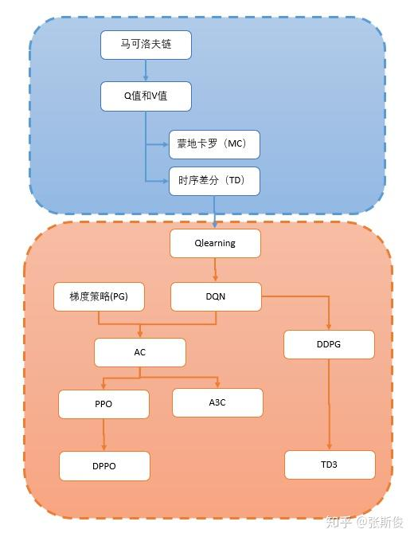
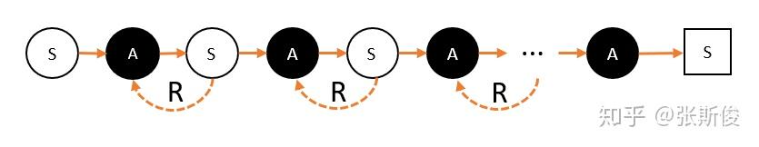
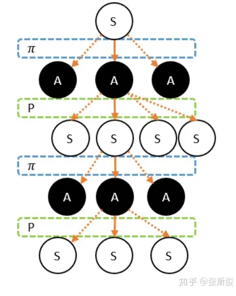

-> [English](/SKILLSETS/AI/RL/rl.md)

# 强化学习

## 学习资料

### [白话强化学习](https://zhuanlan.zhihu.com/p/111869532)

> 点评
- 接地气的大白话，初学者友好
- 感兴趣可以看整个专栏
  - [白话强化学习-专栏](https://zhuanlan.zhihu.com/c_1215667894253830144)

> 概览

- 第一部分为基础知识
- 第二部分为比较流行的模型和方法

> 马尔科夫链 - Markov Chain

- 马可洛夫链描述的是智能体和环境进行互动的过程。简单说：智能体在一个状态(用S代表)下，选择了某个动作(用A代表)，进入了另外一个状态，并获得奖励(用R代表)的过程。所以，我们希望通过让智能体在环境里获取最多的奖励，把智能体训练成我们想要的样子——就是能完成某些特定的任务。

- 事实上，从后往前看，整个过程的发展是链状的。如果从前往后看，实际上应当是树状的过程，因为整个过程的发展充满了不确定性，这种不确定性包括两个方面，第一个方面是策略，第二个方面是状态转移概率。
  
- 策略 - 在图中以Π表示
  - 智能体的每次选择都不是固定的，而是按照一定的策略分布。这个概率分布我们称为策略，用Π表示。
- 状态转移概率 - 在图中以P表示
  - 只跟环境有关关系。例如飞行棋的掷骰子游戏，我们执行同样的动作，也有可能进入不同的状态。

### [强化学习](https://imzhanghao.com/2022/02/10/reinforcement-learning/#%E5%BC%BA%E5%8C%96%E5%AD%A6%E4%B9%A0)
  - 点评：
    - 质量很高
    - 适合初学者从宏观上把握强化学习
    - 具体的方法还需要找更细致的资料进行学习
    - 其中的分类方法值得学习

