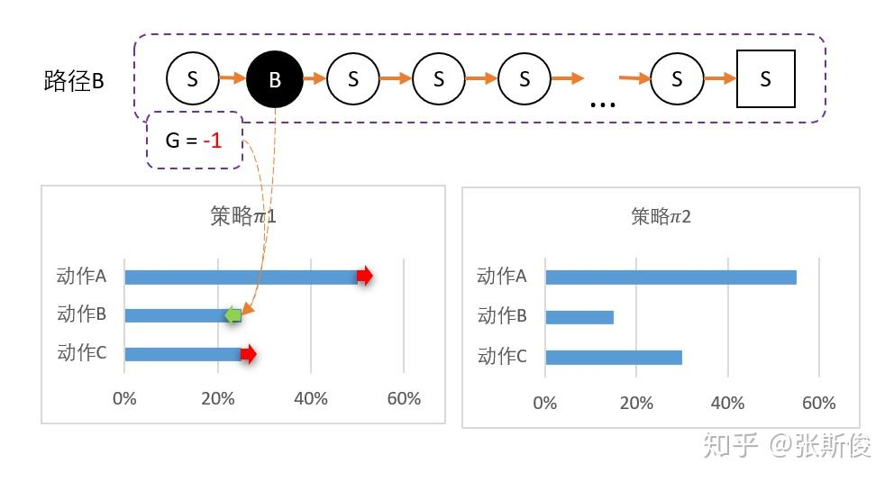

-> [English](/SKILLSETS/AI/RL/rl.md)

# 强化学习

## 学习资料

### 🔗 白话强化学习

[🔗 白话强化学习](https://zhuanlan.zhihu.com/p/111869532)

> 点评
- 接地气的大白话，初学者友好
- 感兴趣可以看整个专栏
  - [白话强化学习-专栏](https://zhuanlan.zhihu.com/c_1215667894253830144)
- 下面是该文的摘录和思考。

> 概览

- 第一部分为基础知识
- 第二部分为比较流行的模型和方法

> 马尔科夫链 - Markov Chain

- 马可洛夫链描述的是智能体和环境进行互动的过程。简单说：智能体在一个状态(用S代表)下，选择了某个动作(用A代表)，进入了另外一个状态，并获得奖励(用R代表)的过程。所以，我们希望通过让智能体在环境里获取最多的奖励，把智能体训练成我们想要的样子——就是能完成某些特定的任务。

- 事实上，从后往前看，整个过程的发展是链状的。如果从前往后看，实际上应当是树状的过程，因为整个过程的发展充满了不确定性，这种不确定性包括两个方面，第一个方面是策略，第二个方面是状态转移概率。
  
- 策略 - 在图中以Π表示
  - 智能体的每次选择都不是固定的，而是按照一定的策略分布。这个概率分布我们称为策略，用Π表示。
- 状态转移概率 - 在图中以P表示
  - 只跟环境有关关系。例如飞行棋的掷骰子游戏，我们执行同样的动作，也有可能进入不同的状态。

> V值和Q值

于是，我们如果要想让智能体能够获得**奖励最大化**就面临两个问题。

1. 未来的路很长，我们不能只凭眼前的收获，就马上做决定；我们要考虑未来；
2. 未来的路充满不确定性：我们不能走一次某一条路，就下决定了。
前路长且险，那我们该怎么办呢？

我们需要**V**和**Q**。

其实V和Q的意义是类似的，唯一的不同是**V是对状态节点的估算**，**Q是对动作节点的估算**。

那估算什么呢？估算从该节点(状态/动作)，一直到最终状态，能够获得的**奖励的总和的平均值**。

请记着这个意义，后面的所有算法基本都会围绕这个定义。因为，如果智能体已经知道某个动作或者状态 一直到最后状态能够一共获得多少奖励。那智能体选多的那个就好了。

> 蒙特卡洛方法（MC）与时序差分方法（TD）

那怎么估算每个节点的价值呢？

蒙特卡罗会让智能体从某个状态S出发，直到最终状态，然后回过头来给每个节点标记这次的价值G。G代表了某次，智能体在这个节点的价值。

经过多次后，把每个状态的G值进行平均。这就是状态的V值。

但为了方便，我们对平均进行一些优化。于是获得用MC估算V值的公式：

而时序差分是一步一回头。用下一步的估值，估算当前状态的估值。

这就相当于，把下一步状态直接当成最终状态。但这个状态它自己包含了这个状态的价值。

因此，我们可以把蒙地卡罗用到的G值，用V(St+1) + r 代替：

注：此图似乎有误，应该是V(St+1) + r 而非 Gt

==================================
> SARSA和Q-Learning

我们之前学习了用TD估算V值。但其实我们用TD预估Q值，其实会来得更方便，因为我们要的就是智能体选择动作嘛。

但问题是，如果既要估算V(St+1),又要估算Q(St,At)。就相当麻烦了。能不能都统一成Q值呢？也就是说V(St+1)用一个动作的Q值所代替。

于是便有两种不同的替代方案：SARSA 和 Qlearning。

> SARSA
SARSA的想法是，用同一个策略下产生的动作A的Q值替代V(St+1)。如下图：

注意：这里的A需要从同一个策略出发。也就是说，如果我们用的是贪心策略，那么我们就要用贪心策略下的动作A的Q值替代V(St+1)。

对应的公式：

我们可以和TD估算V值对比一下，几乎是一模一样的，只是把V换成Q。

但我还是建议记得我们上面说的，我们有用Q替代V(St+1)。因为跳过这一步，我们就理解不了Qlearning了。

> Q-Learning

Qlearning的想法其实也很直观：既然我们的目标是选取最大收益，所以，我们肯定会选择一个能够获得最大Q值的动作。也就是说，在实际选择中，我不可能选择不是最大Q值的动作。所以，**我们应该用所有动作的Q值的最大值替代V(St+1)**。

对应的公式：

Qlearning公式和SARSA相比，就差那么一个max。这个max的意义就是，我们在实际选择动作的时候，会选择最大Q值的动作。

注意：QLearning只适合离散型动作。

> 深度强化学习

为什么深度强化学习这么强，是因为深度强化学习增加了一个很强的武器——深度神经网络。

有人说，深度神经网络很红呀，但我不懂。后面的怎么学？

没关系，如果让我两个字概括，深度神经网络就是一个函数。

函数其实也很简单，就是描述两个东西的对应关系。F(x) = y , 描述的就是x和y之间的关系。

以前的函数，需要我们去精心设计的，要设计，就要描述其中的关系。但有些东西我们明明知道他们有关系，但又不好描述清楚。

例如，手写数字识别，一个正常人写的数字8，我们人类都能认出来。但我们却描述不出来，我们知道是两个圈是8，但有些人的圈明明不闭合，我们也认得出是8...

但深度神经网络这个工具就能自己学会这些关系。它是怎样做的呢？

我们要学习一个神奇函数Maigic(),辨别手写数字，也就是输入一张8的图，输出这个数字是什么。

我们先设一个Magic'(X),其中的X就是输入的图片；
计算结果是各个数字的概率。这个判断一开始通常都是错的，但没关系，我们会慢慢纠正它。
纠正就需要有一个目标，没有目标就没有对错了。这里的目标是我们人类给他们标注的，告诉Magic'：这玩意儿是数字8
目标和现实的输出总是有一段距离的，这段距离我们称为损失(loss).
我们调整我们Magic'函数的参数，让损失最小化。也就是说，离目标越来越近。
最后你就发现Magci’函数的功能离我们心目中要找的Magci函数越来越近。

如果你想更多了解深度神经网络，可以看一下之前的专栏。

> DQN

DQN = Deep learning + Qleanrning。

Qleanrning有一个问题：只能解决格子类型离散型状态问题，对连续型状态束手无策。

这是因为Qlearning在实做的时候用的是Q表格(Qtable)。表格这玩意儿注定就只能存离散的东西。

但我们刚才说的神经网络，正好就能解决这个问题，因为神经网络是个函数。可以处理连续型的问题。两者一拍即合！

有一个问题，是我们用万能的神经网络的时候，需要解决的。就是**更新的目标是什么？网络应该向什么地方优化**。

其实，如果你对之前的Qlearning理解够深的话，就知道，我们更新用的是下一状态的Q值+奖励，作为更新的目标。如下图。

> Double DQN

DQN有很多变种，这里只提一个Double DQN。主要是为了解决一个问题：DQN对Q的估值通常会过大。

直观地说，你可以这样认为： 我们用的是下一状态中，Q值最大的作为当前状态的估算。下一状态的Q值，以下下状态的最大Q值作为估算...这就有点像大话骰,这个Q值越传播就越大。

那怎么办？用两个网络对Q进行预估，取最小的那个。就相当于，你们尽管吹牛，大的我不要，我要小的。

当然，你会说这都可以？答案就是在试验当中，有奇效。

这就是DoubleDQN的想法。

DQN还有其他的一些变种，例如Dueling DQN。大家可以参考一下这几篇文章。

> Policy Gradient 策略梯度

实际上，我们并不需要Q值呀，我们需要的是能获得最多的奖励总和呀。

既然现在我们发明出宇宙最强无敌的Magic函数——神经网络。那我们直接用神经网络magic(s)=A不行吗？

恭喜你，这就是PG的基本思想。

PG用的是MC的G值来更新网络。也就是说，PG会让智能体一直走到最后。然后通过回溯计算G值。

于是得到S - A - G 的数据。这里的G就是对于状态S，选择了A的评分。也就是说， - 如果G值正数，那么表明选择A是正确的，我们希望神经网络输出A的概率增加。(鼓励) - 如果G是负数，那么证明这个选择不正确，我们希望神经网络输出A概率减少。(惩罚) - 而G值的大小，就相当于鼓励和惩罚的力度了。

这里用三个路径来说明一下：

为此，我们可以用带权重的梯度。

> Actor-Critic 演员-评论家

我们知道，MC的效率是相对比较低的，因为需要一直走到最终状态。所以我们希望用TD代替MC。那么我们可不可以把PG和DQN结合呢？

注意：这里是一个大坑。个人更倾向于**把AC理解成PG的TD版本**，而不是PG+DQN。

这是为什么呢？

**Critic网络负责估算Q值** **Actor网络负责估算策略**

这不是很完美吗？

但我们要注意，Q值都是正数，容易掉进“正数陷阱”。

假设我们用Critic网络，预估到S状态下三个动作A1，A2，A3的Q值分别为1,2,10。

但在开始的时候，我们采用平均策略，于是随机到A1。于是我们用策略梯度的带权重方法更新策略，这里的权重就是Q值。

于是策略会更倾向于选择A1，意味着更大概率选择A1。结果A1的概率就持续升高...

那要怎么办？我们把Q值弄成有正有负就可以了。一堆数减去他们的平均值一定有正有负吧！Q减去Q的期望值，也就是V值，就可以得到有正有负的Q了。

也就是说Actor用Q(s,a)-V(s)去更新。但我们之前也说过Q和V都要估算太麻烦了。能不能只统一成V呢？

Q(s,a)用gamma * V(s') + r 来代替，于是整理后就可以得到：

gamma * V(s') + r - V(s) —— 我们把这个差，叫做TD-error

这个和之前DQN的更新公式非常像，只不过DQN的更新用了Q，而TD-error用的是V。

眼尖的同学可能已经发现，如果Critic是用来预估V值，而不是原来讨论的Q值。那么，**这个TD-error是用来更新Critic的loss了**！

所以，强烈建议大家不要把AC看成PG+DQN，而是看成是PG的TD版本。

AC还有个很好的特性，因为我们用两个网络，所以也把连续动作控制型问题解决了。

### 🔗 强化学习
 [🔗 强化学习](https://imzhanghao.com/2022/02/10/reinforcement-learning/#%E5%BC%BA%E5%8C%96%E5%AD%A6%E4%B9%A0)
  - 点评：
    - 质量很高
    - 适合初学者从宏观上把握强化学习
    - 具体的方法还需要找更细致的资料进行学习
    - 其中的分类方法值得学习

