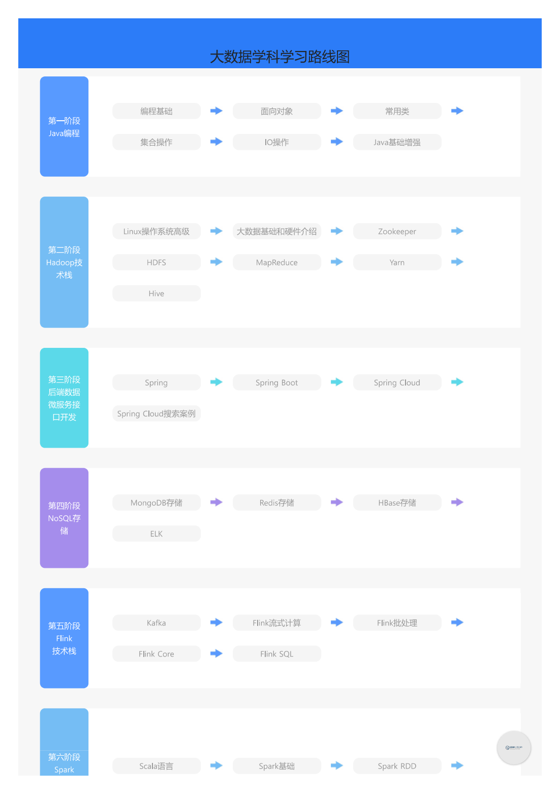
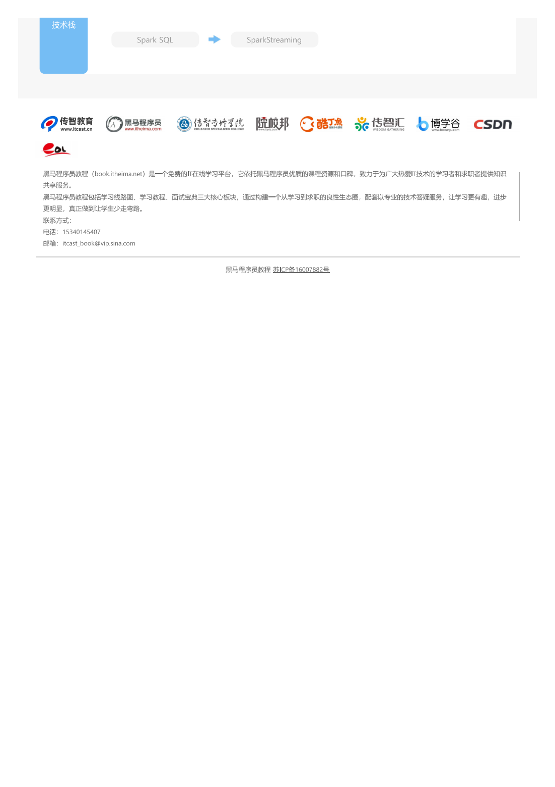

-> [English](/SKILLSETS/AI/ai.md)

# 数据科学与人工智能
## 路线图
**来源:** [🔗 黑马程序员教程-数据科学](https://book.itheima.net/learnline/1269935677353533441)

```pdf
    /docs/SKILLSETS/AI/DataScience.pdf
```






## 通用
- [📗] [🏆] [数据有道](https://github.com/Visualize-ML/Book6_First-Course-in-Data-Science) - in Chinese, Visual ML Series 6

- [📗] [🏆] [机器学习](https://github.com/Visualize-ML/Book7_Visualizations-for-Machine-Learning) - in Chinese, Visual ML Series 7

- [📗] [🏆] [Hello算法](https://www.hello-algo.com/) - in Chinese

- [🌐] [🏆] [动手学深度学习 (En)](https://d2l.ai/)

- [🌐] [动手学深度学习 (CN)](https://zh.d2l.ai/)

- [🌐] [理解深度学习](https://udlbook.github.io/udlbook/)

- [🌐] [Coursera 深度学习专辑](https://www.coursera.org/specializations/deep-learning)

## 计算机视觉
- [📗] [计算机视觉：算法与应用](https://szeliski.org/Book/)

## 时间序列

## 深度学习框架
### Pytorch
- [🌐] [Pytorch](https://pytorch.org/)

### Tensorflow
- [🌐] [Tensorflow](https://www.tensorflow.org/)