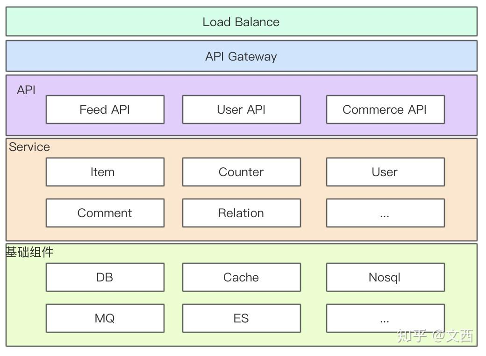
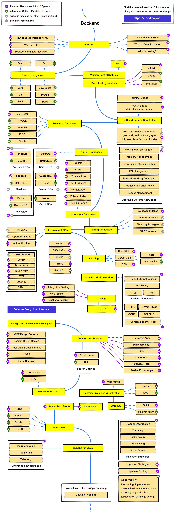

-> [中文](/SKILLSETS/BACKEND/backend-cn.md)

# BACKEND



## BACKEND ROADMAP

**src:** [🔗 roadmap.sh](https://roadmap.sh/backend)



**latest update:** 
```pdf
    https://roadmap.sh/pdfs/roadmaps/backend.pdf
```
