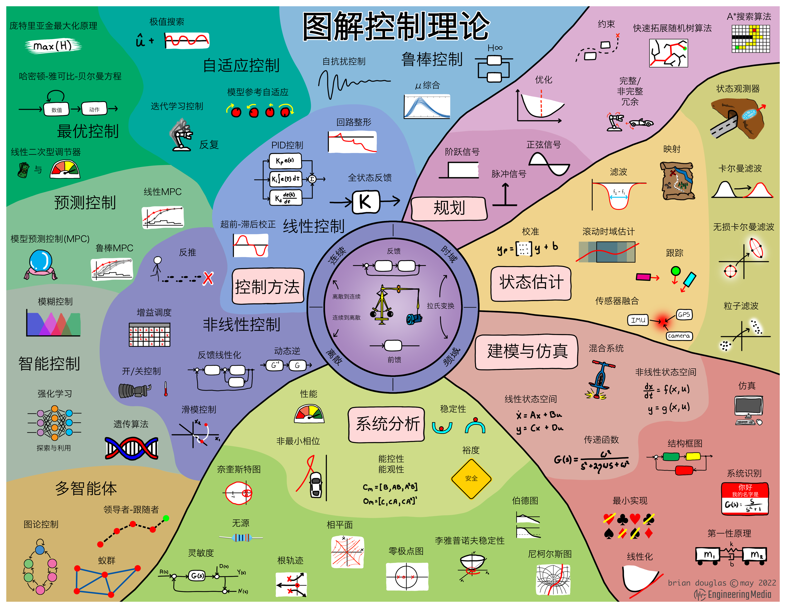

-> [English](/SKILLSETS/CONTROL/control.md)

# 控制
下面这个图可以作为学习控制论的路线图使用，个人觉得非常经典！

图片来源: [Brian Douglas](https://engineeringmedia.com/map-of-control)

# 链接
- [🌐] [Engineering Media](https://engineeringmedia.com/)
  - 点评：
    - 作者 Brian Douglas
    - 在该网站可以找到许多关于控制的教程和资料。
- [📗] [控制理论基础](https://engineeringmedia.com/books)
  - 点评：
    - 该链接为英文版本。
    - 简单易懂，强烈推荐。

- [on going] [📹] [视频合集-控制理论](https://engineeringmedia.com/videos)
  - 点评：
    - Brian Douglas 为 Matlab 创作了许多讲解视频
    - Brian Douglas 也有自己的Youtube频道
    - Youtube视频可能需要一点“魔法”
  - 内容：
    - 控制理论概述
    - 相控阵
    - 雷达
    - 系统识别
    - 模糊逻辑
    - 基于学习的控制
    - 深度学习
    - 系统工程
    - 自主导航
    - 鲁棒控制
    - 传感器融合和跟踪
    - 强化学习
    - 状态空间控制
    - 修整和线性化
    - 无人机模拟与控制
    - 控制系统实践
    - 了解PID控制
