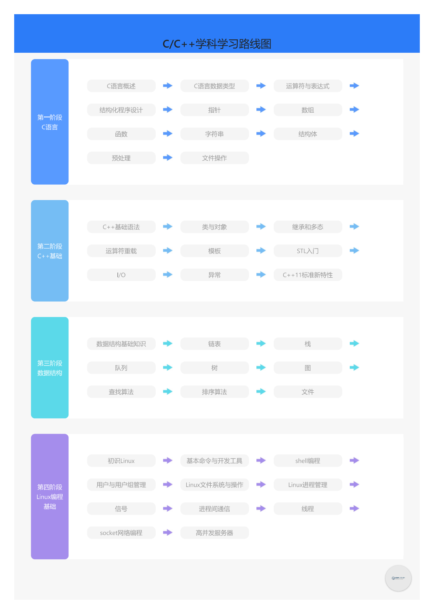

-> [English](/SKILLSETS/EMBEDDED_SYSTEM/embedded_system.md)

# 嵌入式

## C/C++

> 路线图

**来源:** [🔗 黑马程序员教程-C/C++](https://book.itheima.net/learnline/223)

```pdf
    /docs/SKILLSETS/EMBEDDED_SYSTEM/C&C++.pdf
```


