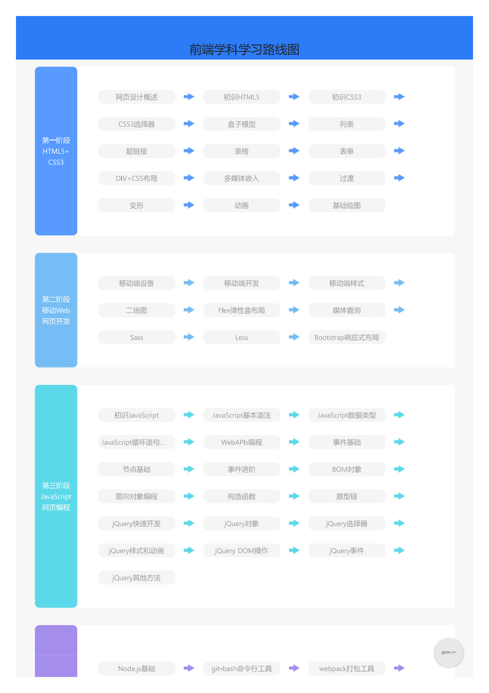

-> [English](/SKILLSETS/FRONTEND/frontend.md)

# 前端

# 前端路线图

**来源:** [🔗 roadmap.sh](https://roadmap.sh/frontend)


**来源:** [🔗 黑马程序员教程-前端路线图](https://book.itheima.net/learnline/1258676978588860418)




**最新:** 
```pdf
    https://book.itheima.net/learnline/1258676978588860418
```
# 黑马程序员前端教程笔记

## HTML5+CSS3
### 网页设计概述 - [✅]
> 网页简介

- WEB 标准
  - 结构 - html
    - HTML
      - HTML 是超文本标记语言（关于该语言会在1.2小节介绍），设计HTML的目的是创建结构化的文档以及提供文档的语义。目前最新版本的超文本标记语言是HTML5。
    - XML
      - XML是一种可扩展标签语言。XML最初的目的是为了弥补HTML的不足，具有强大的扩展性（例如定义标签），可用于数据的转换和描述。
    - XHTML 
      - XHTML是可扩展超文本标记语言。XHTML是基于XML的标记语言，是在HTML4.0的基础上，用XML的规则对其进行扩展建立起来的，用以实现HTML向XML的过渡，目前已逐渐被HTML5所取代。
  - 表现 - css
    - 表现是指网页展示给访问者的外在样式，一般包括网页的版式、颜色、字体大小等。在网页制作中，通常使用CSS来设置网页的样式。在网页中可以使用CSS对文字和图片以及模块的背景和布局进行相应的设置。后期如果需要更改样式只需要调整CSS代码即可。
  - 行为 - javascript
    - 行为是指网页模型的定义及交互的编写，主要包括DOM（对象模型）和ECMAScript两个部分，具体解释如下。
    - DOM（英文Document Object Model的缩写）指的是W3C中的文档对象模型。W3C文档对象模型（DOM）是中立于平台和语言的接口，它允许程序和脚本动态地访问和更新文档的内容、结构和样式。
    - ECMAScript是ECMA（英文European Computer Manufacturers Association的缩写）国际以JavaScript为基础制定的标准脚本语言。JavaScript是一种基于对象和事件驱动，并具有相对安全性的客户端脚本语言，广泛用于Web开发，常用来给HTML网页添加动态功能，例如响应用户的各种操作。

> 网页制作技术入门
- HTML
  - HTML（英文Hyper Text Markup Language的缩写）中文译为“超文本标记语言”，主要是通过HTML标签对网页中的文本、图片、声音等内容进行描述。HTML提供了许多标签，如段落标签、标题标签、超链接标签、图片标签等，网页中需要定义什么内容，就用相应的HTML标签描述即可。
- CSS
  - CSS通常称为CSS样式或层叠样式表，主要用于设置HTML页面中的文本内容（字体、大小、对齐方式等）、图片的外形（宽高、边框样式、边距等）以及版面的布局等外观显示样式。
  - CSS以HTML为基础，提供了丰富的功能，如字体、颜色、背景的控制及整体排版等，而且还可以针对不同的浏览器设置不同的样式。如图1所示，图中文字的颜色、粗体、背景、行间距和左右两列的排版等，都可以通过CSS来控制。
- JAVASCRIPT
  - JavaScript是网页中的一种脚本语言，其前身叫做LiveScript，由Netscape(网景)公司开发。后来在Sun公司推出著名的Java语言之后，Netscape公司和Sun公司于1995年一起重新设计了LiveScript，并把它改名为JavaScript。JavaScript是一种基于对象和事件驱动，并具有相对安全性的客户端脚本语言，广泛用于Web开发，常用来给HTML网页添加动态功能，例如响应用户的各种操作。
- 浏览器
  - 浏览器是用来查看网页的软件，它是客户端软件，主要用于向服务器发出请求，接收服务器返回的网页并显示。常见的浏览器有IE、Firefox、Chrome、Safari、Opera等。在网页制作中，我们需要在不同的浏览器中进行测试，以确保网页在不同的浏览器中都能正常显示。

### 初识HTML5 - [✅]
> HTML5简介

> 标签简介
- 分类
- 关系
- 属性
- 头部标签

> 文本控制标签
 - 页面格式化标签
    - 标题标签
    - 段落标签
    - 水平线标签
    - 换行标签
  - 文本样式标签
  - 文本格式化标签
  - 文本语义标签
  - 特殊字符标签

> 图像标签
- 常见图像格式
- 图像标签
- 相对路径与绝对路径

### 初识CSS3 - [✅]
> 结构与表现分离

> CSS3优势

> CSS3核心基础
- CSS 样式规则
  - 要想熟练地使用CSS对网页进行修饰，首先要了解CSS样式规则。设置CSS样式的具体语法规则  下。
  - 选择器{属性1:属性值1; 属性2:属性值2; 属性3:属性值3; …}
  - 需要注意的是，属性值和单位之间是不允许出现空格的，否则浏览器解析时会出错。
- 引入CSS样式表
  - 行内式
    ```
    <标签名 style="属性1:属性值1; 属性2:属性值2; 属性3:属性值3;"> 内容 </标签名>
    ```
  - 内嵌式
    ```
    <head>
    <style type="text/css">
    选择器 {属性1:属性值1; 属性2:属性值2; 属性3:属性值3;}
    </style>
    </head>
    ```
  - 外部式(推荐)
    ```
    <head>

    <link href="CSS文件的路径" type="text/css" rel="stylesheet" />

    </head>
    ```
    - href：定义所链接外部样式表文件的URL，可以是相对路径，也可以是绝对路径。

    - type：定义所链接文档的类型，在这里需要指定为“text/css”，表示链接的外部文件为CSS样式表。在一些宽松的语法格式中，type属性可以省略。

    - rel：定义当前文档与被链接文档之间的关系，在这里需要指定为“stylesheet”，表示被链接的文档是一个样式表文件。
  - 导入式
    ```
    <head>

    <style type="text/css">

    @import url(CSS文件的路径);

    </style>

    </head>
    ```
    - @import：定义一个外部样式表文件的链接，其后跟随一个URL，表示链接的外部文件为CSS样式表。

    - url：定义所链接外部样式表文件的URL，可以是相对路径，也可以是绝对路径。

    - type：定义所链接文档的类型，在这里需要指定为“text/css”，表示链接的外部文件为CSS样式表。在一些宽松的语法格式中，type属性可以省略。

    - rel：定义当前文档与被链接文档之间的关系，在这里需要指定为“stylesheet”，表示被链接的文档是一个样式表文件。
- CSS基础选择器
  - 要想将CSS样式应用于特定的HTML标签，首先需要找到该目标元素。在CSS中，执行这一任务的样式规则被称为选择器。
  - 标签选择器
    - 标签选择器是指用HTML标签名称作为选择器，按标签名称分类，为页面中某一类标签指定统一的CSS样式，其基本语法格式如下。标签名{属性1:属性值1; 属性2:属性值2; 属性3:属性值3; }
  - 类选择器
    - 类选择器使用“.”（英文点号）进行标识，后面紧跟类名，其基本语法格式如下。
      ```
      .类名{属性1:属性值1; 属性2:属性值2; 属性3:属性值3; }
      ```
  - ID选择器
    - id选择器使用“#”进行标识，后面紧跟id名，其基本语法格式如下。
      ```
      #id名{属性1:属性值1; 属性2:属性值2; 属性3:属性值3; }
      ``` 
  - 通配符选择器
    - 通配符选择器用“*”号表示，它是所有选择器中作用范围最广的，能匹配页面中所有的元素，其基本语法格式如下。
      ```
      *{属性1:属性值1; 属性2:属性值2; 属性3:属性值3; }
      ```

> 设置文本样式
- CSS 字体样式属性
    - font-size
      - font-size属性用于设置字体的大小，其基本语法格式如下。
        ```
        font-size:属性值;
        ```
      - 属性值可以是绝对单位，也可以是相对单位。绝对单位包括像素（px）、英寸（in）、厘米（cm）、    毫米（mm）、点（pt）和派卡（pc）等，相对单位包括em、ex和百分比（%）等。
    - font-family
      - font-family属性用于设置字体的名称，其基本语法格式如下。
        ```
        font-family:属性值;
        ```
      - 属性值可以是字体的名称，也可以是字体的英文名称。如果字体名称中包含空格，需要用引号将其括    起来，如“宋体”、“Times New Roman”等。
    - font-weight
      - font-weight属性用于设置字体的粗细，其基本语法格式如下。
        ```
        font-weight:属性值;
        ```
      - 属性值可以是normal（正常）、bold（粗体）、bolder（更粗）、lighter（更细）或100、200、   300、400、500、600、700、800、900等。
    - font-style
      - font-style属性用于设置字体的风格，其基本语法格式如下。
        ```
        font-style:属性值;
        ```
      - 属性值可以是normal（正常）、italic（斜体）或oblique（倾斜）。其中，italic和oblique的    区别在于，italic是指浏览器支持的斜体字体，而oblique是指浏览器倾斜普通字体的样式。
    - font
      - font属性用于设置字体的样式，其基本语法格式如下。
        ```
        font:属性值;
        ```
      - 属性值的书写顺序可以是font-style、font-weight、font-size、font-family，也可以是 font-style、font-variant、font-weight、font-size、line-height、font-family，其中 font-style、font-weight和font-family是必须的，其他的都是可选的。如果省略了某个属性值，则 会使用浏览器的默认值。
    - font-face规则
      - font-face规则用于定义一种新的字体，其基本语法格式如下。
        ```
        @font-face{font-family:属性值; src:属性值;}
        ```
      - font-family：定义字体的名称，可以是字体的名称，也可以是字体的英文名称。如果字体名称中包 含空格，需要用引号将其括起来，如“宋体”、“Times New Roman”等。
      - src：定义字体的路径，可以是相对路径，也可以是绝对路径。
- CSS文本外观属性
  - color
    - color属性用于设置文本的颜色，其基本语法格式如下。
      ```
      color:属性值;
      ```
    - 属性值可以是颜色的名称，也可以是颜色的英文名称。如果颜色名称中包含空格，需要用引号将其括起来，如“红色”、“#FF0000”、“rgb(255,0,0)”等。
  - letter-spacing
    - letter-spacing属性用于设置字符间距，其基本语法格式如下。
      ```
      letter-spacing:属性值;
      ```
    - 属性值可以是绝对单位，也可以是相对单位。绝对单位包括像素（px）、英寸（in）、厘米（cm）、 毫米（mm）、点（pt）和派卡（pc）等，相对单位包括em、ex和百分比（%）等。
  - word-spacing
    - word-spacing属性用于设置单词间距，其基本语法格式如下。
      ```
      word-spacing:属性值;
      ```
    - 属性值可以是绝对单位，也可以是相对单位。绝对单位包括像素（px）、英寸（in）、厘米（cm）、 毫米（mm）、点（pt）和派卡（pc）等，相对单位包括em、ex和百分比（%）等。
  - line-height
    - line-height属性用于设置行高，其基本语法格式如下。
      ```
      line-height:属性值;
      ```
    - 属性值可以是绝对单位，也可以是相对单位。绝对单位包括像素（px）、英寸（in）、厘米（cm）、 毫米（mm）、点（pt）和派卡（pc）等，相对单位包括em、ex和百分比（%）等。
  - text-transform
    - text-transform属性用于设置文本的大小写，其基本语法格式如下。
      ```
      text-transform:属性值;
      ```
    - 属性值可以是none（不转换）、capitalize（首字母大写）、uppercase（大写）或lowercase（小写）。
  - text-decoration
  - text-align
  - text-indent
  - white-space
  - text-shadow
  - text-overflow
  - word-wrap

> CSS高级特性
- CSS复合选择器
  - 书写CSS样式表时，可以使用CSS基础选择器选中目标元素。但是在实际网站开发中，一个网页可能包含成千上万的元素，如果仅使用CSS基础选择器，是远远不够的。为此CSS提供了几种复合选择器，实现了更强、更方便的选择功能。
  - 标签指定式选择器
  - 后代选择器
  - 并集选择器

- CSS层叠性与继承性
  - 层叠性
    - 所谓层叠性是指多种CSS样式的叠加。例如当使用内嵌式CSS样式表定义<p>标签字号大小为12像素，链入式定义<p>标签颜色为红色，那么段落文本将显示为12像素红色，即这两种样式产生了叠加。
  - 继承性
    - 继承性是指书写CSS样式表时，子标签会继承父标签的某些样式，如文本颜色和字号。

- CSS优先级


### CSS3选择器

### 盒子模型

### 列表

### 超链接

### 表格

### 表单

### DIV+CSS布局

### 多媒体嵌入

### 过渡

### 变形

### 动画

### 基础绘图

## 移动WEB开发

### 移动端基础知识

### Flex伸缩布局

### 媒体查询

### Sass

### Less

### Bootstrap响应式布局

## JavaScript网页编程

### 初识JavaScript
> 什么是JavaScript
- 概述
- JavaScript的诞生和发展
- JavaScript的特点
- JavaScript的组成
  - ECMAScript
    - ECMAScript：是JavaScript的核心。ECMAScript规定了JavaScript的编程语法和基础核心内容，是所有浏览器厂商共同遵守的一套JavaScript语法工业标准。
  - DOM
    - DOM：文档对象模型，是W3C组织推荐的处理可扩展标记语言的标准编程接口，通过DOM提供的接口，可以对页面上的各种元素进行操作（如大小、位置、颜色等）。
  - BOM
    - BOM：浏览器对象模型，它提供了独立于内容的、可以与浏览器窗口进行互动的对象结构。通过BOM，可以对浏览器窗口进行操作（如弹出框、控制浏览器导航跳转等）。

> JavaScript入门
- 代码书写位置
  - 行内式
    - 行内式是指将JavaScript代码直接写在HTML标签的事件属性中，其基本语法格式如下。
      ```
      <标签名 事件="JavaScript代码"></标签名>
      ```
  - 内嵌式
    - 内嵌式是指将JavaScript代码写在HTML文档的<head>标签中，其基本语法格式如下。
      ```
      <head>
      <script type="text/javascript">
      JavaScript代码
      </script>
      </head>
      ```
  - 外部式
    - 外部式是指将JavaScript代码写在一个单独的文件中，一般使用“js”作为文件的扩展名，在HTML页面中使用标签进行引入，适合JavaScript代码量比较多的情况。外部式有利于HTML页面代码结构化，把大段的JavaScript代码独立到HTML页面之外，既美观，也方便文件级别的代码复用。需要注意的是，外部式的标签内不可以编写JavaScript代码。

- 注释
  - 单行注释 //
  - 多行注释/**/ 

- 输入和输出语句
  - alert()函数
    - alert()函数用于在浏览器中弹出一个警告框，其基本语法格式如下。
      ```
      alert(“提示信息”);
      ```
  - prompt()函数
    - prompt()函数用于在浏览器中弹出一个提示框，其基本语法格式如下。
      ```
      prompt(“提示信息”);
      ```
  - console.log()函数
    - console.log()函数用于在浏览器的控制台中输出信息，其基本语法格式如下。
      ```
      console.log(“提示信息”);
      ```

- 控制台的使用
  - 在浏览器的控制台中可以直接输入JavaScript代码来执行，这为JavaScript初学者提供了很大的便利。打开控制台后，会看到一个闪烁的光标，此时可以输入代码，按回车键执行。图1演示了直接在控制台中输入代码执行的效果。

### Javascript基础
> 变量
- 什么是变量
- 变量的使用
  - 声明变量
  - 变量赋值
  - 变量初始化
- 变量的语法细节
  - 更新变量的值
  - 同事声明多个变量
  - 声明变量的特殊情况
- 变量的命名规范
  - ① 由字母、数字、下划线和美元符号（$）组成，如age、num。② 严格区分大小写，如app和App是两个变量。③ 不能以数字开头，如18age是错误的变量名。④ 不能是关键字、保留字，如var、for、while等是错误的变量名。⑤ 要尽量做到“见其名知其意”，如age表示年龄，num表示数字。⑥ 建议遵循驼峰命名法，首字母小写，后面的单词首字母大写，如myFirstName。

> 数据类型
- 变量的数据类型
- 数据类型分类
  - 基本数据类型
    - 数值型
    - 字符串型
    - 布尔型
    - 空值型
    - 未定义型
  - 引用数据类型
    - 对象型
    - 数组型
    - 函数型
- 数字型
  - 进制
    - （1）在数字开头加上0，表示八进制数。八进制数由0~7组成，逢8进位。
    - （2）在数字开头加上0x，表示十六进制数。十六进制数由0~9，a~f组成。
  - 范围
    ```
    console.log(Number.MAX_VALUE);  // 输出结果：1.7976931348623157e+308
    console.log(Number.MIN_VALUE);  // 输出结果：5e-324
    ```
- 特殊值
  - NaN
    - NaN是Not a Number的缩写，表示不是一个数字。NaN是一个特殊的数值，它和任何值都不相等，包括它自己。NaN是一个数值，但是它和任何数值都不相等，包括它自己。NaN是一个特殊的数值，它和任何值都不相等，包括它自己。
  - Infinity
    - Infinity表示无穷大，它是一个数值，但是它和任何数值都不相等，包括它自己。

- 字符串型
  - 单双引号嵌套
  - 转义符
  - 字符串的长度
  - 访问字符串中的字符
    - 0 开始
  - 字符串的拼接
    - +
- 布尔型
  - 布尔型的取值
  - 布尔型的应用
- undefined 和 Null
- 数据类型检测
  - typeof
- 转换为字符串型
  - toString()
  - String()
- 转换为数字型
  - parseInt()
  - parseFloat()
  - Number()
  - 算数运算符隐式转换
- 转换为布尔
  - Boolean()

> 运算符
- 算数运算符
- 递增和递减运算法
  - “--”
  - “++”
- 比较运算符
- 逻辑运算符
  - &&
  - ||
  - !
- 赋值运算符
- 三元运算符
- 运算符优先级

> 流程控制

> 分支结构
- if
- switch

> 循环结构
- for
- while
- do while
- continue
- break

> 初识数组
- 创建数组
  - new Array()
  - []
- 访问数组元素
  - 数组名[索引]
- 数组遍历

> 数组元素操作
- 修改数组长度
- 新增或修改数组元素
- 筛选数组
- 删除指定的数组元素
- 翻转数组元素顺序

### Javascript函数

### Javascript对象

### DOM

### BOM

### 面向对象编程

### 正则表达式

## jQuery网页编程

### jQuery入门

### jQuery样式和动画

### jQuery DOM 操作

### jQuery其他方法