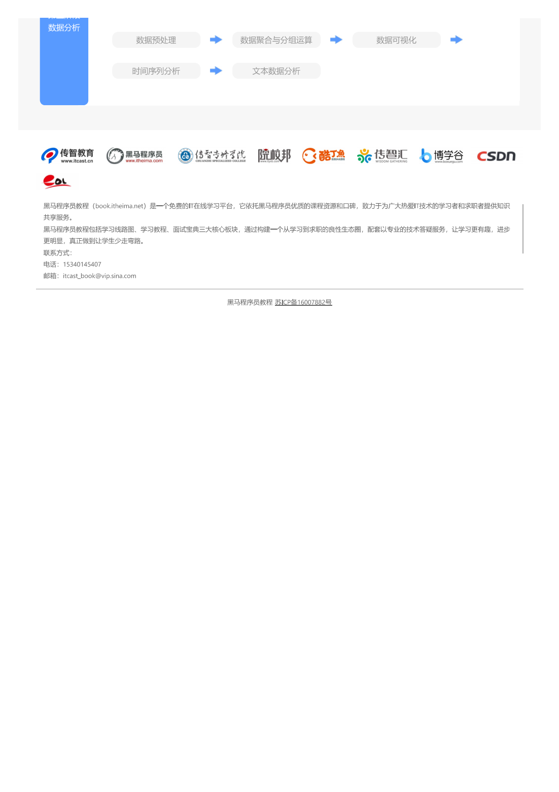

-> [English](/SKILLSETS/MATH/PYTHON/python.py)

# PYTHON

## 路线图

**来源：** [黑马程序员-PYTHON](https://book.itheima.net/learnline/221)

```pdf
    /docs/SKILLSETS/MATH/PYTHON/Python.pdf
```




# 编程不难-PYTHON
以下为鸢尾花系列的第一篇的学习感悟，主要介绍Python的相关内容,仅记录重要部分，详细内容请参考原书。
链接：[📗] [编程不难](https://github.com/Visualize-ML/Book1_Python-For-Beginners)

```pdf
    https://github.com/l1xnan/merge-pdf-book/blob/master/Book1_Python-For-Beginners_%E7%BC%96%E7%A8%8B%E4%B8%8D%E9%9A%BE.pdf
```

注意：如果不能正常显示请访问Github连接进行下载。
## CH01 聊聊“巨蟒”
> Python用途
- 机器学习
- 深度学习
- Web开发
- 自动化脚本
- 游戏开发
- 系统管理和网络编程

> 重要的python库
- Pandas
- Numpy
- SciPy
- SymPy
- StatsModels
- Scikit-learn
- Matplotlib
- Seaborn
- Plotly

> 理解模块、包、库

- 模块 (Module)：是一个 Python 程序文件，包含了一组相关的函数、类、变量和常量等，可供其他程序引用。Python 中的模块是一种可重用的代码组件，可用于将相关的代码组织到一起，以便更好地管理和维护代码。一个模块可以包含多个函数、类、变量和常量等，可以被其他模块或程序引用和调用。
- 包 (Package)：是一组相关的模块的集合，用于组织 Python 代码的层次结构。一个包是一个文件夹，其中包含其他模块或子包。包是一种通过模块命名空间进行模块组织的方式，可用于更好地组织和管理大型代码库。
- 库 (Library)：是由一组模块和包组成的软件组件，提供了一系列函数、类、变量和常量等，用于解决特定问题。Python 标准库是 Python 官方提供的一组库，包含了大量的模块和功能，可以直接使用。此外，还有第三方库，如 NumPy、Pandas、Matplotlib 等，用于数据处理、科学计算、可视化等领域。

> 为什么要学Python？

> 怎么学Python？

Coding！Coding！Coding！

> Anaconda
- Anaconda 可谓“科学计算全家桶”，包含科学计算领域可能用到的大部分 Python 工具，包括
Python 解释器、常用的第三方库、包管理器、IDE 等。前文提到的 JupyterLab、Spyder、PyCharm
这三个 IDE 都在 Anaconda 中。

- Anaconda 是一个流行的 Python 发行版，由 Anaconda, Inc.开发和维护，旨在为数据科学、机器学习和科学计算提供一个全面的工具包。Anaconda 集成了许多常用的 Python 库和工具，如 NumPy、SciPy、Pandas、Matplotlib、Scikit-learn、JupyterNotebook 等。它还包括一个名为 conda 的软件包管理器，可以帮助用户安装、更新和管理 Python 库和依赖项。Anaconda还提供了一个名为 Anaconda Navigator 的图形用户界面，用户可以通过这个界面轻松地管理他们的 Python 环境、安装和卸载库、启动 Jupyter Notebook 等操作。除了 Python 环境和库之外，Anaconda 还包括许多其他工具和应用程序，如Spyder、PyCharm、VS Code、R 语言环境等等，使得它成为数据科学家和研究人员的首选工具之一。Anaconda 可以安装在多个平台上，包括 Windows、Linux 和 Mac OS X。

## CH02 JupyterLab
> 什么是JupyterLab？

JupyterLab 是一个交互式开发环境，可以让用户创建和共享 Jupyter 笔记本、代码、数据和文档。它是 Jupyter Notebook 的升级版本，提供了更强大的功能和更直观的用户界面。JupyterLab 支持多种语言，包括 Python、R、Julia 和 Scala 等。它还提供了多个面向数据科学的扩展，如 JupyterLab Git、JupyterLab LaTeX 和 JupyterLab Debugger 等，使得数据科学家和开发人员可以更加高效地进行数据分析、机器学习和模型开发等工作。JupyterLab 的主要特点包括：基于 web 的用户界面，可以让用户同时在一个界面中管理多个笔记本和文件。支持多种文件格式，包括 Jupyter 笔记本、Markdown 文档、Python脚本和 CSV 文件等。可以通过拖放和分栏等方式来组织和管理笔记本和文件。提供了一组内置的编辑器、终端、文件浏览器和输出查看器等工具。可以通过扩展系统来扩展和定制 JupyterLab 的功能。JupyterLab 集合“浏览器 + 编程 + 文档 + 绘图 + 多媒体 + 发布”众多功能与一身。对于初学者，哪怕是有开发经验的读者来说，JupyterLab 都特别适合探究式学习。

?> VSCode+Jupyter

在VSCode中使用*.ipynb文件，效果类似，还可以利用VSCode的插件进行代码格式化，代码提示等操作，重要的是Copilot的支持，可以大大提高编程效率。

> Cell 是什么

在 JupyterLab 中，Cell (单元格) 是指一个包含代码或文本的矩形区域，它是用户编写和执行代码、编写文本和渲染
Markdown 的基本单位。Cell 可以包含多种类型的内容，包括代码、Markdown、LaTeX 公式等。JupyterLab 中的 Cell 可以通过交互式的方式进行编辑和执行。例如，在 Code Cell 中，用户可以编写 Python 代码，并使用 Shift+Enter 快捷键执行代码并显示结果；在 Markdown Cell 中，用户可以使用 Markdown 语法编写文本，并使用 Shift+Enter 快捷键渲染 Markdown文本。JupyterLab 中的 Cell 还支持多种交互式扩展，例如使用 IPython Magic 命令、使用自动完成、代码补全和代码调试等。Cell 也可以被复制、剪切、粘贴、移动和删除，使得用户可以轻松地组织和管理笔记本中的内容。

可以是代码单元格，也可以是文本单元格。文本单元格可以是 Markdown 单元格或 Raw 单元格。Markdown 单元格用于编写和渲染 Markdown 文本，Raw 单元格用于显示原始文本。在 JupyterLab 中，单元格可以通过交互式的方式进行编辑和执行。例如，在 Code 单元格中，用户可以编写 Python 代码，并使用 Shift+Enter 快捷键执行代码并显示结果；在 Markdown 单元格中，用户可以使用 Markdown 语法编写文本，并使用 Shift+Enter 快捷键渲染 Markdown 文本。JupyterLab 中的单元格还支持多种交互式扩展，例如使用 IPython Magic 命令、使用自动完成、代码补全和代码调试等。单元格也可以被复制、剪切、粘贴、移动和删除，使得用户可以轻松地组织和管理笔记本中的内容。

在 JupyterLab 中，Markdown 是一种轻量级标记语言，可以用于编写文档、笔记和报告等。通过使用 Markdown 语法，用户可以在 JupyterLab 中轻松地创建格式化文本、插入图片、添加链接、创建列表等。Markdown 语法非常简单，易于学习和使用。例如，使用 Markdown 语法，用户可以使用井号 (#) 来创建标题，使用“-”或“*”符号加上空格来创建 bulletlist，使用双星号(**)来加粗文本，使用单星号 (*) 来斜体文本等。用户可以在 Markdown 单元格中编写 Markdown 语法，然后使用 Shift+Enter 键来渲染 Markdown 文本。JupyterLab 中的 Markdown 支持 LaTeX 语法，用户可以使用 LaTeX 语法来插入数学公式，从而方便地创建数学笔记和报告。

> Kernel 是什么

JupyterLab 中，内核 (kernel) 是指与特定编程语言交互的后台进程，它负责编译和执行用户在 JupyterLab 中编写的代码，并返回执行结果。内核与 JupyterLab 之间通过一种称为“Jupyter 协议”的通信协议进行交互。打开一个新的 notebook 或console 时，JupyterLab 会自动启动一个内核，这个内核将与该 notebook 或 console 中编写的代码进行交互。在 notebook 或console 中编写代码，并使用内核来执行它们。内核还可以保存笔记本中的变量和状态，使得大家可以在多个代码单元格之间共享变量和状态。JupyterLab 支持多种编程语言的内核，可以在启动 notebook 或 console 时选择要使用的内核。例如，如果想使用 Python 内核，可以选择“Python 3”内核。一旦选择了内核，JupyterLab 将与该内核建立连接，并使用它来执行该 notebook 或 console 中编写的代码。如果希望在 notebook 或 console 中使用其他语言的内核，需要先安装并配置这些内核。

> 快捷键


## CH04 Python语法
> 常见关键词

> Python与C语言区别

> 注释
使用#或者""" """进行注释

> 缩进

- 缩进对于Python来说非常重要，不同的缩进代表了不同的层级关系，这样的缩进方式使得代码更加简洁，但是也容易出错，因此在编写代码时一定要注意缩进的正确性。
- 注意，缩进的大小没有严格规定，一般情况下建议使用四个空格作为缩进，并不鼓励用制表符 tab 缩进。特别反对混用四个空格、tab 缩进。

> 变量
- 数字
- 字符串
- 列表
- 元组
- 集合
- 字典
- 布尔
- None

> 命名
- 大驼峰
- 小驼峰
- 蛇形命名（下划线）（推荐）

> 导入包
- 导入整个包
  - import 包名
  - 需要使用完整的包名进行调用，如：包名.模块名.函数名
- 导入包且指定别名
  - import 包名 as 别名
  - 使用别名进行调用，如：别名.模块名.函数名
- 导入包中的某个模块
  - from 包名 import 模块名
  - 可以直接使用模块名进行调用，如：模块名.函数名
- 导入包中所有模块
  - from 包名 import *

> Pythonic
- Pythonic 是指符合 Python 语言风格指南 (Pythonic) 的代码，它是一种 Python 代码的风格，可以使得代码更加简洁、易读、易维护。Pythonic 代码的特点包括：使用 Python 语言的特性和语法，例如使用列表推导式、字典推导式、集合推导式、生成器表达式、装饰器、上下文管理器等。使用 Python 内置的函数和数据结构，例如使用内置函数、使用列表、元组、集合和字典等。使用 Python 内置的模块和包，例如使用 os 模块、使用 sys 模块、使用 itertools 模块等。使用 Python 内置的面向对象特性，例如使用类、使用继承、使用多态等。使用 Python 内置的异常处理机制，例如使用 try...except...finally 语句、使用 raise 语句等。使用 Python 内置的模块和包，例如使用 os 模块、使用 sys 模块、使用 itertools 模块等。使用 Python 内置的面向对象特性，例如使用类、使用继承、使用多态等。使用 Python 内置的异常处理机制，例如使用 try...except...finally 语句、使用 raise 语句等。

## CH05 Python数据类型
> 数据类型
- 数字
- 字符串
- 列表
- 元组
- 集合
- 字典
- 布尔
- None

> 数字
- 整数
- 浮点数
- 复数

- check type of variable
```python
type(variable)
```

- type conversion
```python
int(variable)
float(variable)
complex(variable)
str(variable)
```

> Exception
- ValueError
- TypeError
- ZeroDivisionError
- IndexError
- FileNotFoundError

> 特殊数值
use math module

- 无穷大
```python
float('inf')
```

- 无穷小
```python
float('-inf')
```

- 非数值
```python
float('nan')
```

- pi
```python
import math
math.pi
```

- e
```python
import math
math.e
```

- sqrt2
```python
import math
math.sqrt(2)
```

other functions in math

round()

ceil()

floor()

pow()

abs()

exp()

log()

log10()

> but usually we use numpy, pandas, etc

> 字符串
- 单引号 ' '
- 双引号 " "
- 三引号 ''' ''' """ """

- + 字符串拼接
- * 字符串复制

len() 字符串长度

> 索引 切片 indexing slicing
- 索引 index
  - 正向索引
    - 从0开始
  - 反向索引
    - -1代表最后一个元素
    - -2代表倒数第二个元素
    - ...
- 切片 slice
  - [start:end:step]
  - start 默认为0
  - end 默认为最后一个元素
  - step 默认为1， 该值可以省略
  - 左闭右开

常见字符串方法
- capitalize()
  - 将字符串的第一个字符转换为大写
- count()
  - 返回字符串中指定子字符串出现的次数
- isalnum()
  - 如果字符串至少有一个字符并且所有字符都是字母或数字，则返回 True，否则返回 False
- isdigit()
  - 如果字符串只包含数字，则返回 True，否则返回 False
- join()
  - 将序列中的元素以指定的字符连接生成一个新的字符串
- replace()
  - 将字符串中指定的子字符串替换为另一个字符串，并返回替换后的字符串

> 列表
- 列表是一种非常常见的数据类型，它是一种有序的数据集合，可以包含任意类型的数据，例如数字、字符串、列表、元组、集合、字典、布尔值、None 等。列表是 Python 中最常用的数据类型之一，它非常灵活，可以用于存储和处理各种数据。列表是可变的，可以通过索引和切片来访问列表中的元素，还可以使用 append()、insert()、extend()、remove()、pop()、clear()、reverse()、sort() 等方法来修改列表。列表还支持使用 for 循环来遍历列表中的元素，还可以使用列表推导式来创建列表。
- 支持嵌套
- 可以通过二次索引访问嵌套列表中的元素
- 列表是可变的，可以通过索引和切片来访问列表中的元素，还可以使用 append()、insert()、extend()、remove()、pop()、clear()、reverse()、sort() 等方法来修改列表。列表还支持使用 for 循环来遍历列表中的元素，还可以使用列表推导式来创建列表。
- 元组不可变

> 视图，浅拷贝，深拷贝
- 视图是指对列表的引用，它是列表的一个别名，对视图的修改会影响到原列表，反之亦然。视图的创建方式包括切片、copy() 方法、list() 方法、列表推导式等。
- 浅拷贝是指创建一个新的列表，新列表中的元素是原列表中元素的引用，对新列表的修改不会影响到原列表，但是对原列表中元素的修改会影响到新列表。浅拷贝的创建方式包括 copy() 方法、list() 方法、列表推导式等。
  - 浅拷贝只对第一层元素进行复制，对于嵌套的元素，浅拷贝只会复制它的引用，而不会复制它的值。所以浅拷贝中的深层元素还是会和原列表中的元素共享同一块内存，对深层元素的修改会影响到原列表。
- 深拷贝是指创建一个新的列表，新列表中的元素是原列表中元素的副本，对新列表的修改不会影响到原列表，对原列表的修改也不会影响到新列表。深拷贝的创建方式包括 copy.deepcopy() 方法、列表推导式等。
  - 深拷贝会递归地复制所有层级的元素，包括嵌套的元素，深拷贝会复制它的值，而不会复制它的引用。

> 其他数据类型

- 元组
  - 元组是一种有序的数据集合，可以包含任意类型的数据，例如数字、字符串、列表、元组、集合、字典、布尔值、None 等。元组是 Python 中最常用的数据类型之一，它非常灵活，可以用于存储和处理各种数据。元组是不可变的，不能修改元组中的元素，但是可以通过索引和切片来访问元组中的元素。元组还支持使用 for 循环来遍历元组中的元素，还可以使用元组推导式来创建元组。
  - 元组使用圆括号()，列表使用方括号[]，元组是不可变的，列表是可变的。
  - 元组的优势在于其更轻量级，元组的创建和访问速度都比列表更快，元组在创建后就不能修改，因此更安全，可以避免意外修改数据。

- 集合
  - 集合是一种无序的数据集合，可以包含任意类型的数据，例如数字、字符串、列表、元组、集合、字典、布尔值、None 等。集合是 Python 中最常用的数据类型之一，它非常灵活，可以用于存储和处理各种数据。集合是可变的，可以通过 add()、update()、remove()、discard()、pop()、clear() 等方法来修改集合。集合还支持使用 for 循环来遍历集合中的元素，还可以使用集合推导式来创建集合。
  - 可以使用花括号{}，或者 set() 函数来创建集合，集合中的元素是无序的，不允许重复，集合中的元素必须是不可变的，例如数字、字符串、元组等，不能包含可变的数据类型，例如列表、集合、字典等。

```python
number_set = {1, 2, 3, 4, 5}
word_set = set(["apple", "banana", "orange"])

# add() 方法用于向集合中添加元素
fruit_set = set(["apple", "banana"])
fruit_set.add("orange")

# update() 方法用于向集合中添加多个元素
fruit_set.update(["grape", "kiwi"])

# remove() 方法用于删除集合中的指定元素
fruit_set.remove("banana")

# discard() 方法用于删除集合中的指定元素
fruit_set.discard("orange")

# pop() 方法用于删除集合中的第一个元素

#删除元素：使用 remove() 或者 discard() 方法删除集合中的元素，如果元素不存在，remove() 方法会引发 KeyError 异常，而 discard() 方法则不会。
```

- 字典
  - 键值对
  - 字典是一种无序的数据集合，可以包含任意类型的数据，例如数字、字符串、列表、元组、集合、字典、布尔值、None 等。字典是 Python 中最常用的数据类型之一，它非常灵活，可以用于存储和处理各种数据。字典是可变的，可以通过索引和切片来访问字典中的元素，还可以使用 update()、pop()、clear() 等方法来修改字典。字典还支持使用 for 循环来遍历字典中的元素，还可以使用字典推导式来创建字典。
  - 可以使用花括号内键值对，或者 dict() 函数来创建字典，字典中的元素是无序的，不允许重复，字典中的键必须是不可变的，例如数字、字符串、元组等，不能包含可变的数据类型，例如列表、集合、字典等。

> 矩阵、向量

## CH06 Python常见运算
> 几类运算符

- 算术运算符
  - + - * / // % **
- 比较运算符
  - == != > < >= <=
- 逻辑运算符
  - and or not
- 赋值运算符
  - = += -= *= /= //= %= **=
- 成员运算符
  - in not in
- 身份运算符
  - is is not
- 位运算符
  - & | ^ ~ << >>

> 算术运算符
- 加减法
- 乘除法
  - NumPy数组完成矩阵乘法时用的运算符是 @
- 括号

> 比较运算符
- 比较运算符用于比较两个值，如果比较结果为真，则返回 True，否则返回 False。比较运算符包括等于运算符 (==)、不等于运算符 (!=)、大于运算符 (>)、小于运算符 (<)、大于等于运算符 (>=) 和小于等于运算符 (<=)。比较运算符的结果是布尔值，可以用于条件判断。

> 逻辑运算符

> 赋值运算符

> 成员运算符
- 成员运算符用于判断指定的元素是否存在于指定的数据集合中，如果存在，则返回 True，否则返回 False。成员运算符包括 in 运算符和 not in 运算符。in 运算符用于判断指定的元素是否存在于指定的数据集合中，如果存在，则返回 True，否则返回 False。not in 运算符用于判断指定的元素是否不存在于指定的数据集合中，如果不存在，则返回 True，否则返回 False。成员运算符的结果是布尔值，可以用于条件判断。

> 身份运算符

> 优先级

# Python 控制结构
> 什么是控制结构
- 条件语句
- 循环语句
- 异常处理
  - try...except...finally
  ```python
    try:
      # 代码块
    except:
      # 代码块
    finally:
      # 代码块
  ```
> 条件语句
- if
- if...else...
- if...elif...else...
- break, continue, pass
  - break 用于终止循环，break 语句通常与 if 语句一起使用，当满足某个条件时，使用 break 语句终止循环。
  - continue 用于跳过循环中的某些代码，continue 语句通常与 if 语句一起使用，当满足某个条件时，使用 continue 语句跳过循环中的某些代码。
  - pass 用于占位，pass 语句通常与 if 语句一起使用，当满足某个条件时，使用 pass 语句跳过循环中的某些代码。
> 循环语句
- enumerate()
  - enumerate() 函数用于将一个可遍历的数据对象 (如列表、元组或字符串) 组合为一个索引序列，同时列出数据和数据下标，一般用在 for 循环中。enumerate() 函数的语法格式为：enumerate(iterable, start=0)，其中 iterable 为可遍历的数据对象，start 为索引起始值，默认为 0。
- zip()
  - zip() 函数用于将多个可迭代对象组合为一个元组序列，同时列出数据和数据下标，一般用在 for 循环中。zip() 函数的语法格式为：zip(*iterables)，其中 iterables 为可迭代对象，可以是多个可迭代对象，也可以是一个可迭代对象。
- 列表生成式
  - 表达方式为：[expression for item in iterable]，其中 expression 为表达式，item 为可迭代对象中的元素，iterable 为可迭代对象。
- 向量化
- 矩阵乘法为@
> 迭代器
- 排列与组合
- 有放回和无放回

# CH08 Python函数

> 什么是Python函数

- 包 模块 函数

> 自定义函数

- 无输入无返回
- 多输入，单一返回
- 多输入，多返回
- 部分输入有默认值

> 匿名函数
- lambda
- 匿名函数是一种快速定义单行函数的方式，它是一种特殊的函数，可以在一行代码中定义函数，不需要使用 def 关键字，也不需要使用 return 关键字，匿名函数的语法格式为：lambda arguments: expression，其中 arguments 为函数的参数，expression 为函数的返回值。
  
map() 函数用于对可迭代对象中的每个元素应用指定的函数，并返回一个可迭代对象，map() 函数的语法格式为：map(function, iterable, ...)，其中 function 为函数，iterable 为可迭代对象，可以是多个可迭代对象，也可以是一个可迭代对象。

> 构造模块、库
- 模块是一种 Python 程序文件，包含了一组相关的函数、类、变量和常量等，可供其他程序引用。Python 中的模块是一种可重用的代码组件，可用于将相关的代码组织到一起，以便更好地管理和维护代码。一个模块可以包含多个函数、类、变量和常量等，可以被其他模块或程序引用和调用。
- 简单来说，若干函数可以打包成一个模块，几个模块可以打包成一个库。

- 自定义模块

- 自定义库
  - 在 Python 中，可以使用 setuptools 库中的 setup()函数将多个模块打包成一个库。