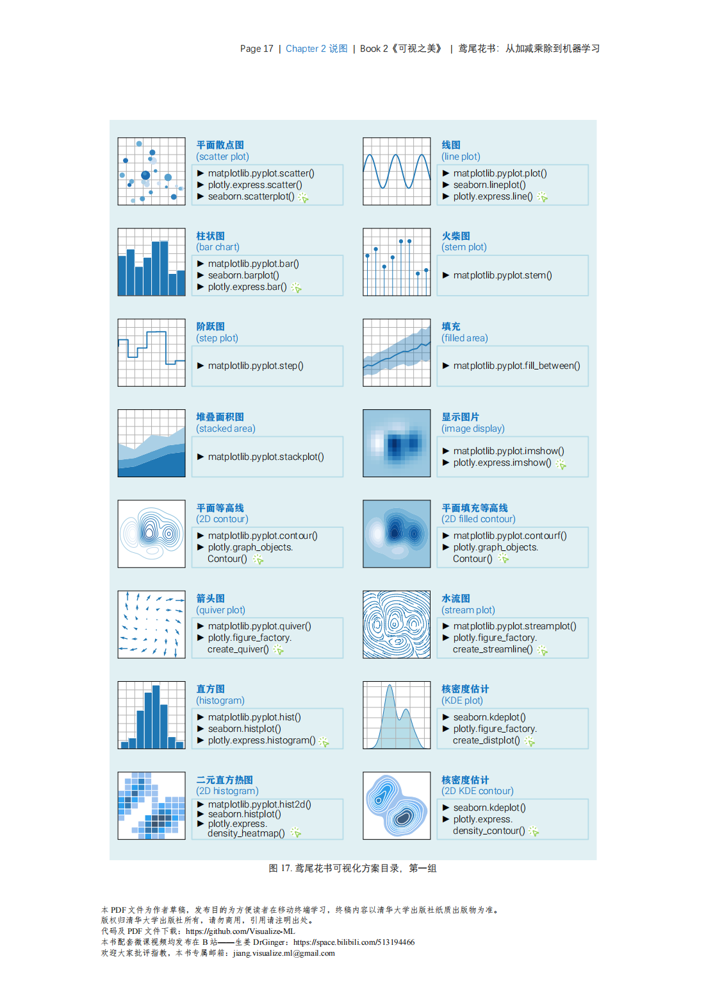
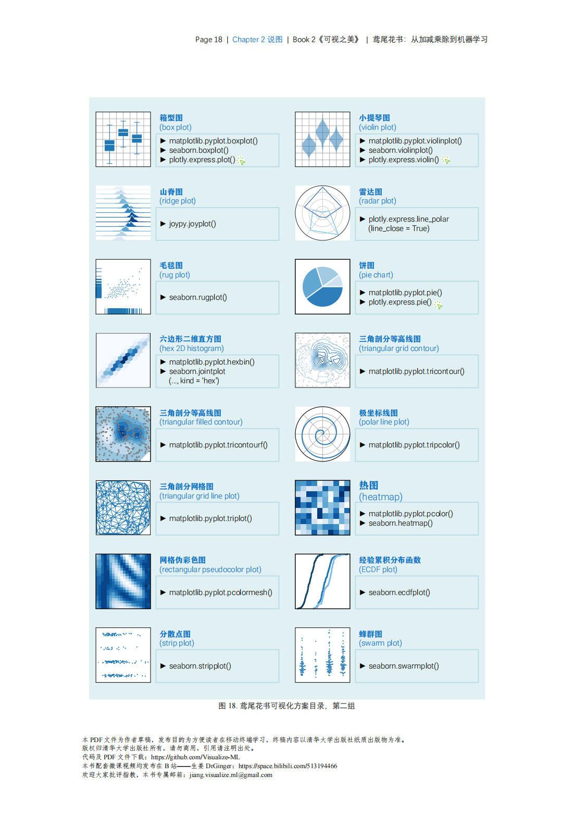
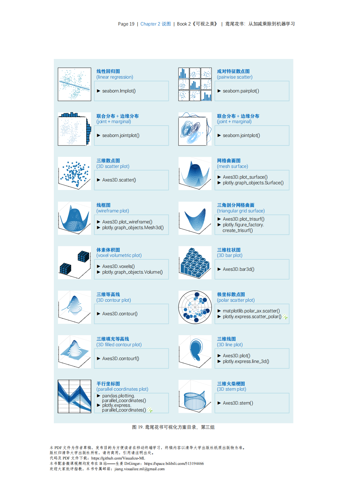
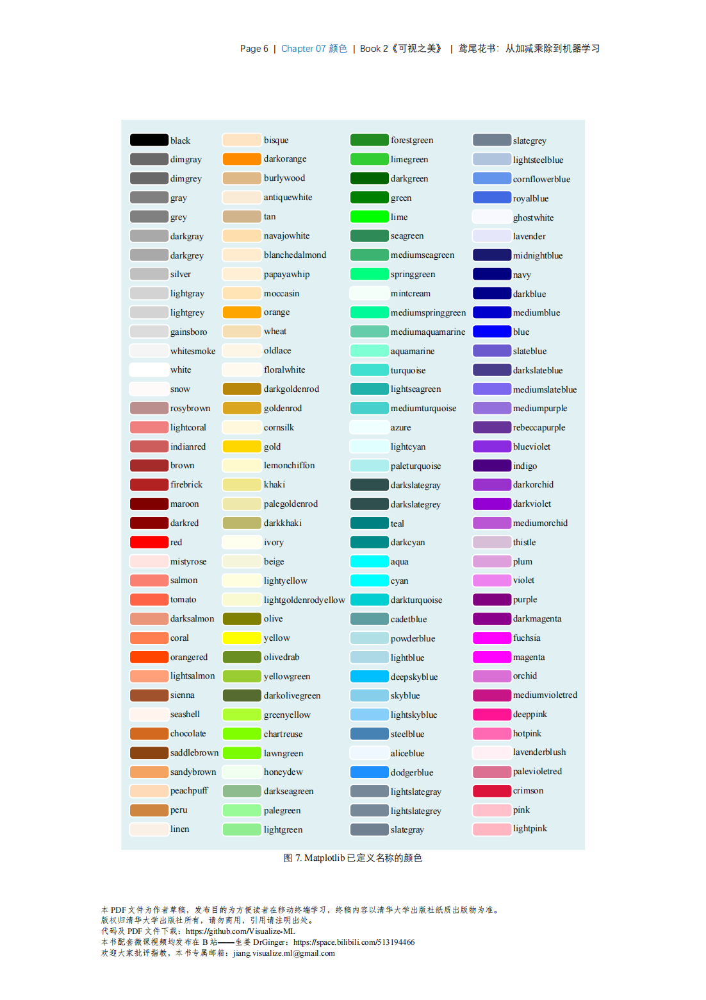
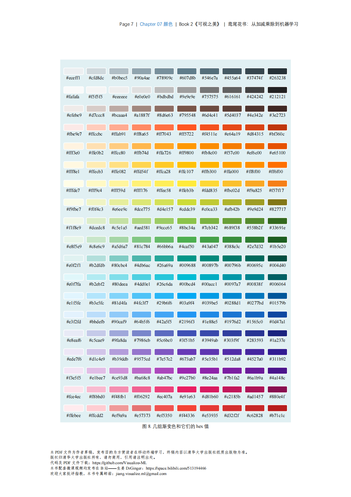

-> [English](/SKILLSETS/MATH/VISUALIZATION/visualization.md)

本文档为鸢尾花系列的第二篇的学习感悟，主要介绍可视化的相关内容,仅记录重要部分，详细内容请参考原书。
链接：[📗] [可视之美](https://github.com/Visualize-ML/Book2_Beauty-of-Data-Visualization)

```pdf
    https://github.com/l1xnan/merge-pdf-book/blob/master/Book2_Beauty-of-Data-Visualization_%E5%8F%AF%E8%A7%86%E4%B9%8B%E7%BE%8E.pdf
```
注意：如果不能正常显示请访问Github连接进行下载。

# 可视化

大纲：图说，美化，色彩，二维，三维，数学之美

# CH01 数学+艺术

# CH02 说图

常见图类型：




# CH03 布局

# CH04 装饰

# CH05 风格

# CH07 颜色



# CH08 色彩空间

# CH09 色谱

# CH10 平面散点

68-95-99.7 法则

# CH11 平面线图
curse of dimensionality

# CH12 平面填充

# CH13 极坐标绘图

# CH14 各种网格

# CH15 平面等高线

# CH16 热图

